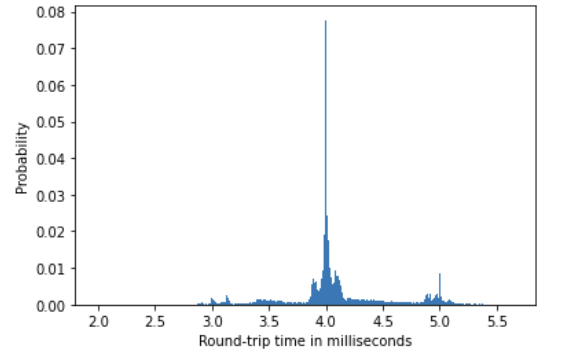

# Serial

The communication between the controller and the commander is done over a serial
interface. This allows for real-time communication, though only when proper hardware
implementations are in place on both ends.

In most cases, serial peripherals for a PC and for the Arduino will not be available,
at which point it makes sense to fall back to the Serial-over-USB capability of the
Arduino Due.

Note that this introduces latency due to the finite frame exchange interval of the USB
protocol. In practice this means a round-trip time of ≈ 4ms when using Serial-over-USB.

## Round-trip time

The round-trip time is defined as the time from sending a _ping_ until the 
corresponding _pong_ has been received.

Below is a measurement of $5 \cdot 10^4$ `ping-pong` episodes. 

The vast majority of episodes seem to fall around the $4\, \text{ms}$ mark.

{align=center}

## Protocol alignment

Since the [Protocol](protocol.md) operates at a byte-level, there is no easy
way to realign to a packet ID if misalignment ever occurs. For this reason,
a reliable serial connection is critical.

Ensure that an appropriate baudrate is used.

## Buffer size

By default the serial buffer size of the Arduino is a measly 64 bytes, which means that
it will quickly overflow and cause misalignment if not read from sufficiently often.

This can be mitigated by ensuring that the Commander empties the serial buffer often,
and further mitigated by increasing the buffer size using the `SERIAL_BUFFER_SIZE` definition.

This can be done using _platform.io_ in the `platformio.ini` file with a build flag `-DSERIAL_BUFFER_SIZE=<buffer size>`
